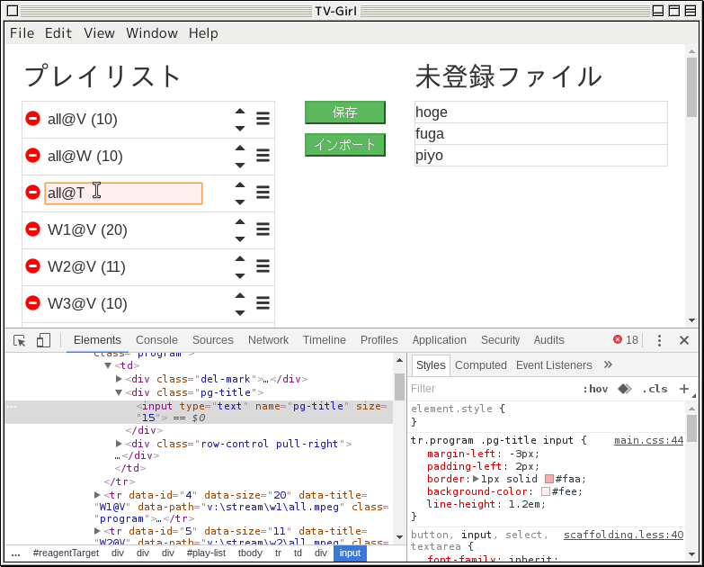

# ClojureScriptとElectronでデスクトップアプリを作る

## TV-Girl

とあるビデオキャプチャソフトで録画した番組のプレイリストを編集するソフトを作る。

### TODO(for sprint#3 or later)

- パスとファイル数(実ファイル数)を表示
- インポート
- 監視
- 監視対象フォルダ設定
- フォルダをエクスプローラで開く
- VLCで再生
- 未登録リストのソート

## スクリーンショット

## ポイント

- Electronを使うと、JSとCSSでUIを作れる

  (Webアプリを作る感覚でデスクトップアプリを作れる)

- ClojureScriptを使うと、JSの代わりにClojureの文法で書ける
- Reagentを使うと、React.jsのスタイル(仮想DOM)でUIを動かせる

  また、DOMをClojureのデータ構造として記述できる

- Figwheelを使うと、ソースの修正が自動的にアプリに反映される

- REPLを使うと、実行中のアプリを動的にマニピュレートできる

## 主な登場人物

- ClojureScript
- Electron
- Reagent
- Figwheel

- rlwrap ...REPLでhistoryとかが使えるようになる
- foreman(a ruby gem) ...複数プロセスの起動をワンタッチで
- asar ...npmのアーカイバ

プロジェクトのベースは、[Gonzih/cljs-electron](https://github.com/Gonzih/cljs-electron)です。

## 環境

### いつものやつ

- Gentoo Linux
- Vim(+fireplace)
- Leiningen
- JDK 1.8
- Ruby 2.1

### Node.js, Electron, asar

    $ sudo emerge nodejs -av
    $ vim ~/.npmrc
        prefix = /home/maru/local
    $ export PATH=$PATH:~/local/bin
    $ npm install electron-prebuild -g
    $ npm install asar -g

### foreman

    $ export PATH=$PATH:~/.gem/ruby/2.1.0/bin
    $ gem install foreman

### rlwrap

    $ sudo emerge rlwrap -av

## 実行/開発

ターミナルを2つ使用。

    $ cd tv-girl
    $ foreman start

    $ cd tv-girl
    $ electron .

- foreman側のターミナルがREPL
- `(js/alert "hoge")`などとやれば、アラートが出る
- `:cljs/quit`で終了

- electronアプリはChromium(Chromeのオープンソース版)を内蔵してるので、お馴染みの開発ツール(F12とかCtrl+Shift+I)が使える
- cljsソースやCSSの修正は動的に反映される
- index.htmlを修正した場合はページのリロードが必要
- project.cljを修正した場合は、figwheel(つまりforeman)を再起動

## Vim

- Vim(fireplace)からRELPへつなぐには、`:Connect nrepl://localhost:7888`
- ただ、何かと問題あり
- Connectできるが`cpp`や`K`が期待通りに動かない
- パッチを当てると、`cpp`は通るようになった
- でも`K`するとCompilerExceptionが出る

      CompilerException .... Unable to resolve symbol: ...
      Error detected while processing function .... fireplace#evalparse

## jQueryを使う場合

単純にjquery.min.jsをロードするだけだと、`window.$`などが初期化されないので、明示的に`require`する。

    // index.html
    

cljs側からは`js/$`でアクセス。

    // *.cljs
    (-> (js/$ ".logos")
        (.css (clj->js {:display "none"})))

## リリース

### ビルド

    $ cd tv-girl
    $ lein cljsbuild once frontend-release
    $ lein cljsbuild once electron-release

### 必要なもの

- `package.json`
- `resources`ディレクトリ以下のすべて
- asarで固める
- electronのバイナリ(配布先OSに合わせたバージョン)とともに配布

### 例
    // Linuxの場合
    $ cd tv-girl
    $ mkdir -p package/tv-girl/resources/app
    $ cp -r ~/local/lib64/node_modules/electron-prebuilt/dist/* package/tv-girl/
    $ cp package.json package/tv-girl/resources/app/
    $ cp -r resources package/tv-girl/resources/app/
    $ cd package/tv-girl
    $ ./electron        ...ちゃんと起動することを確認
    $ cd resources/app
    $ asar pack . ../app.asar
    $ cd ..
    $ rm -rf app/

で、`tv-girl`ディレクトリを配布。
